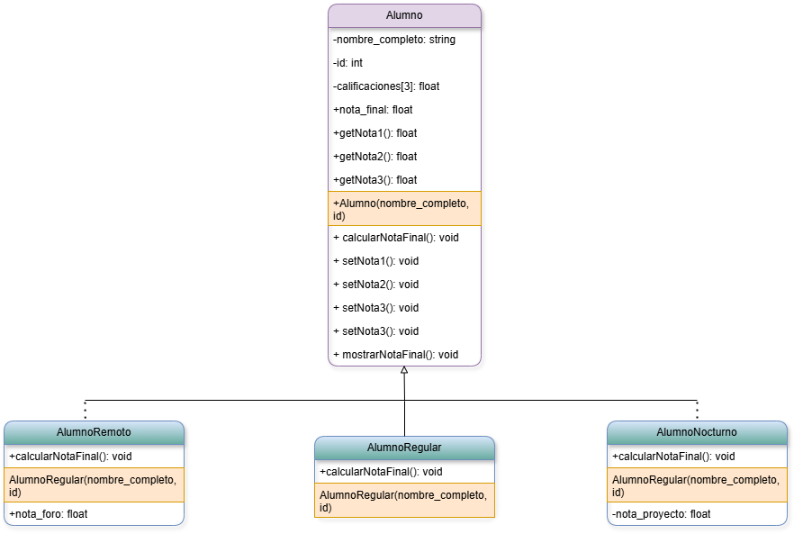

# Taller 1

## 1. Enunciado

Se necesita un sistema que envíe notificaciones a los usuarios a través de diferentes medios: correo electrónico, SMS y notificaciones push. Todas las notificaciones deben contener un mensaje y un destinatario, pero el método de envío varía según el tipo. Utilizar herencia y polimorfismo de esta manera:

- Herencia: Se crea una clase base `Notificacion` con atributos como mensaje y destinatario. Luego, se crean subclases `NotificacionEmail` , `NotificacionSMS` y `NotificacionPush`.

- Polimorfismo: Se sobrescribe el método `enviar()` en cada subclase para definir la forma específica de envío.

## 2. Diagrama UML de abstracción

Se crearon dos clases `Persona` y `IMC`. Al crear el objeto `Persona`, se crea el objeto `IMC`, con ello, se puede acceder directamente a los atributos de `IMC` de `Persona`, pues se calculan al construirse `Persona`.

## 3. Análisis de complejidad espacial

- Análisis de la Clase `Notificacion`
  - Métodos.
    1. `enviar()` → 0 bytes (void).
  - Atributos.
    1. `msg` → X_1 bytes (string).
    2. 
  - Ecuación de complejidad espacial.

- Análisis de la Clase `Persona`
  - Métodos.
    1. `getPeso()` → 4 bytes (float).
  - Atributos.
    1. `imc` → X_1 + X_2 + 24 bytes (IMC).
  - Ecuación de complejidad espacial.

    4(3) + Y_1 + X_1 + X_2 + 24 + Y_2 + 4(3)

    = Y_1 + Y_2 + X_1 + X_2 + 12 + 12 + 24

    = Y_1 + Y_2 + X_1 + X_2 + 48

- Análisis de la Clase `GrupoPersonas`
  - Métodos.
    1. `agregarPersona()` → 0 bytes (void).
    2. `operator` →  Y_1 + Y_2 + X_1 + X_2 + 48 bytes (Persona).
    3. `mostrarPersonas()` → 4 bytes (int).
  - Atributos.
    1. `personas` → M(8 + N) bytes (Persona **), donde `N` es el número de personas.
  - Ecuación de complejidad espacial.

    Y_1 + Y_2 + X_1 + X_2 + 48 + 4 + M(8 + N) + 4(2)

    = Y_1 + Y_2 + X_1 + X_2 + M(8 + N) + 50
- Análisis del `main()`
  - Variables.
    1. `cantidad` → 4 bytes (int).

